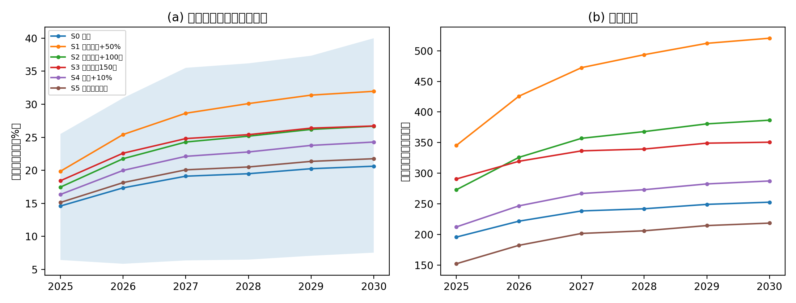
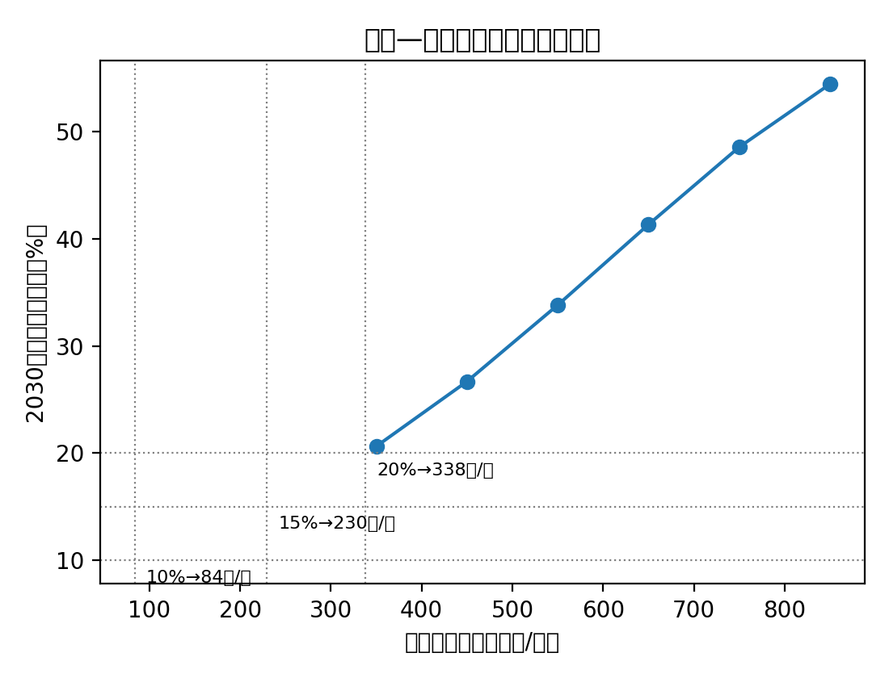

**摘要：**扩种大豆是保障我国粮油安全的重要政策目标，其成效最终取决于农户的种植决策。本文利用全国农村固定观察点黑龙江样本2021—2024年农户面板数据，构建"微观计量校准+主体建模（ABM）仿真"的两层分析框架：首先以动态离散选择模型估计大豆种植参与和种植份额对玉米—大豆预期净收益差的行为响应，进而将估计参数注入农户主体模型，对2025—2030年差异化补贴政策组合进行前瞻仿真。研究发现：（1）大豆与玉米的预期市场净收益差平均约为每亩-470元，生产者补贴差（2024年约330元/亩）显著收窄但未完全弥合该缺口；（2）补贴差每提高100元/亩，农户大豆种植概率平均提高约2.8个百分点，且响应强度随经营规模单调递增，大规模农户约为小规模农户的8倍；（3）种植决策存在很强的状态依赖，上年种豆使当年续种概率提高约27个百分点，政策的跨期"棘轮"效应明显；（4）情景仿真显示，维持现行补贴强度下样本区大豆面积份额到2030年可升至19%左右；将补贴增量瞄准新增轮作面积的财政效率最高，每提升1个百分点份额的财政成本比普惠性提标低约27%。据此，本文提出"稳定存量补贴预期、增量瞄准轮作扩面、区域差异化投放"的政策组合。

**关键词：**大豆扩种；生产者补贴；种植结构；动态离散选择；主体建模

# 一、引言

大豆是我国对外依存度最高的大宗农产品，进口依存度长期保持在80%以上。2019年农业农村部启动实施"大豆振兴计划"，2022年、2023年中央一号文件连续对"扩大大豆油料生产"作出部署，黑龙江作为全国最大的大豆主产省承担了最主要的扩种任务。政策工具箱的核心是玉米、大豆差异化生产者补贴：大豆生产者补贴标准持续显著高于玉米，2023年以来原则上保持在每亩350元以上，比玉米高出300元/亩以上。然而，补贴驱动的扩种能走多远、财政代价多大、补贴结构如何优化，均取决于一个微观问题：农户的种植选择对补贴差究竟有多敏感？

已有文献对农业供给反应的研究传统深厚。自Nerlove（1956）以来，作物面积对预期价格的响应一直是农业经济学的核心议题；Chavas和Holt（1990）将风险因素纳入玉米—大豆面积配置模型，奠定了两作物竞争框架。国内研究多利用省级或县级面积数据估计大豆供给弹性与临储、目标价格改革的政策效应，但宏观数据难以识别农户层面的决策机制——参与（种不种）与强度（种多少）两个边际、种植惯性（状态依赖）、邻里示范等微观机制在加总数据中相互混淆。而这些机制恰恰决定了补贴政策的动态效果：若存在强状态依赖，一次性补贴冲击会通过"进入—锁定"机制产生持续效应；若响应集中于大户，补贴的瞄准设计就有优化空间。

在方法上，评估尚未发生的政策组合（如提高补贴标准、改变补贴结构）需要超出样本区间的反事实模拟。主体建模（agent-based model，ABM）为此提供了自然工具：以真实农户为主体、以计量估计的行为方程为决策规则，可以在保持微观异质性和动态反馈（惯性、同伴效应、轮作农学约束）的同时进行政策前瞻（Berger, 2001；Happe et al., 2006）。但国内应用中行为参数多为外部设定，缺乏与微观计量的严格对接，"计量校准的ABM"仍属少见。

本文利用全国农村固定观察点黑龙江样本2021—2024年的农户面板数据，对上述问题给出一个微观的、可外推的回答。样本覆盖三个代表性县区：松嫩平原南部玉米优势区的哈尔滨市双城区、三江平原农牧交错区的佳木斯市桦南县、松嫩平原西北部旱作区的齐齐哈尔市甘南县，恰好构成大豆适宜性由低到高的梯度。本文的分析分两层展开。第一层，从原始问卷逐户构建"玉米—大豆预期净收益差"（含市场收益差与补贴差两个可分解部分），以动态混合logit模型估计参与方程、以分数logit模型估计份额方程，处理状态依赖、村内同伴效应与未观测异质性。第二层，将参与方程与份额方程的系数及其协方差矩阵注入ABM，以2024年为基年校准，经留出样本回测检验后，对2025—2030年六种政策情景进行蒙特卡洛仿真，并反解实现给定扩种目标（大豆面积份额10%、15%、20%）所需的补贴标准与财政成本。

本文可能的边际贡献有三。其一，利用全国农村固定观察点微观面板，在农户层面同时识别大豆种植决策的价格（收益差）响应、状态依赖与规模异质性，为"补贴究竟有没有用、对谁有用"提供直接证据；其二，方法上将微观计量与ABM严格对接——行为参数、参数不确定性（系数协方差）、未观测户异质性与宏观年度冲击均进入仿真，政策结论附带可信区间，避免了行为参数外生设定的任意性；其三，政策上给出补贴—份额响应曲线、目标反解与财政成本前沿，并比较普惠性提标与瞄准增量的轮作补贴的财政效率，为差异化补贴的结构优化提供定量依据。

本文余下部分安排如下：第二部分梳理政策背景并给出分析框架；第三部分介绍数据与变量构建；第四部分报告计量结果；第五部分给出ABM的结构、校准与验证；第六部分报告政策情景仿真结果；最后是结论与政策含义。

# 二、政策背景与分析框架

## （一）玉米、大豆差异化生产者补贴

2016年玉米临时收储制度改革后，东北地区建立玉米、大豆"市场化收购+生产者补贴"机制。黑龙江省按照"省级统一测算、县域组织落实"的方式确定分作物亩均补贴标准。2019年"大豆振兴计划"实施后，大豆与玉米的补贴差持续拉大：2021年大豆生产者补贴248元/亩、玉米68元/亩；2022年分别为248元/亩和28元/亩；2023年起大豆补贴原则上保持在350元/亩以上，玉米降至约15—20元/亩，补贴差扩大到330元/亩左右。此外，黑龙江自2022年起对新增大豆轮作面积实施每亩150元的耕地轮作补贴试点。本文利用样本农户申报的分作物补贴金额对上述标准进行了交叉验证：以"纯玉米户申报补贴金额/玉米播种面积"反推的玉米亩均补贴率，在三县2021—2024年分别为43—63元、28—40元、14—19元和17—20元，与官方标准基本吻合，说明补贴发放到户情况良好。

## （二）农户种植决策的分析框架

考虑农户$i$在年份$t$于玉米（$m$）与大豆（$s$）之间配置既定耕地$B_{it}$。设两作物的亩均预期净收益分别为$\pi_{m,it}$与$\pi_{s,it}$，其差额

$$\Delta\pi_{it}=\left(\hat{p}_{s,ct-1}\hat{y}_{s,i}-\hat{c}_{s,ct-1}+sub_{s,t}\right)-\left(\hat{p}_{m,ct-1}\hat{y}_{m,i}-\hat{c}_{m,ct-1}+sub_{m,t}\right) \qquad (1)$$

是种植选择的核心经济信号。其中价格与亩均现金成本按县域$c$上一年实现值形成朴素预期（播种决策发生在春季，当年价格尚不可知，而补贴标准在播种前已经公布，故取当年值）；$\hat{y}_{k,i}$为农户$k$作物的潜在单产。式（1）可分解为市场收益差$\Delta\pi^{mkt}_{it}$与补贴差$\Delta\pi^{sub}_{t}=sub_{s,t}-sub_{m,t}$两部分，这一分解是政策仿真的接口：补贴情景只改变第二项。

农户决策包含两个边际。参与边际（种不种大豆）由潜在效用比较决定，除$\Delta\pi$外还受三类动态与社会因素影响：一是状态依赖——种子、农机具、技术学习与销售渠道的专用性投资使上年种豆者本年更可能续种（Foster and Rosenzweig, 1995）；二是村内同伴效应——邻里的种植结果提供信息外部性（Conley and Udry, 2010）；三是未观测的户异质性（土壤、偏好、能力）。强度边际（种多少）在参与者内部由份额方程刻画，受轮作农学约束（大豆重迎茬减产）与地块规模影响。第三、四部分的计量模型即对应这一框架，第五部分的ABM则将其动态化并纳入一般化的反馈。

# 三、数据、变量与描述性事实

## （一）数据来源与样本

本文数据来自全国农村固定观察点调查黑龙江省样本2021—2024年的户问卷与村问卷。观察点样本覆盖双城区（松嫩平原南部，玉米优势区）、桦南县（三江平原南缘）与甘南县（松嫩平原西北部旱作区）三个县区。原始数据经过如下清洗：（1）以身份证号为主键、村代码加户主姓名为辅键匹配农户，剔除同年重复录入记录；（2）从"种植业分产品生产及销售情况表"与"种植业分产品成本投入表"逐产品提取播种面积、产量、销售量与销售收入及各项现金投入；（3）对单产、销售单价、亩均成本设定农艺合理域（如玉米单产100—1000公斤/亩、大豆30—350公斤/亩），越界值置缺失。最终得到玉米或大豆播种面积为正的非平衡面板884户次、366户，其中含上年种植信息（用于构造滞后变量）的估计样本496户次。种植业亩均现金成本包括种子、化肥、外购有机肥、农药、农膜、排灌、机械作业、运输仓储、贷款利息、保险费、其他费用及雇工支出，不含土地租金与自家劳动折价。

## （二）变量构建

被解释变量为大豆种植参与$D_{it}$（大豆播种面积>0）与大豆份额$s_{it}$（大豆面积/玉米大豆合计面积）。核心解释变量$\Delta\pi_{it}$按式（1）构建：价格与亩均成本取县×年中位数（县内有效观测不足5个时回退全样本中位数）；潜在单产采用经验贝叶斯收缩，
$$\hat{y}_{k,i,t}=\frac{\sum_{\tau<t}y_{k,i\tau}+K\,\tilde{y}_{k,c}}{n_{k,i,t}+K},\qquad K=2 \qquad (2)$$
即农户历史单产均值向县中位数收缩，从未种植该作物的农户取县中位数，避免自选择造成的单产高估；补贴标准取上文的官方省级口径。控制变量包括户主年龄、受教育年限、家庭劳动力人数与经营规模对数$\ln B_{it}$。村内同伴变量$\bar{s}_{-i,v,t-1}$为剔除本户后上年村内其他样本户的平均大豆份额（leave-one-out，缓解Manski（1993）反射问题）。

## （三）描述性事实

表1报告分县分年的大豆参与率与面积份额。三个典型事实值得注意。第一，区域分化极其显著：双城区四年内无一户种植大豆——在玉米单产高达800—900公斤/亩的核心玉米带，大豆完全不具竞争力，属于结构性零参与；桦南、甘南两县参与率则在11%—62%之间波动。第二，2023年后扩种加速：全样本面积加权大豆份额从2021年的5.5%、2022年的4.0%升至2023年的7.7%和2024年的13.0%，与2023年补贴差从220元/亩跳升至330元/亩以上的时点吻合。第三，收益差的空间梯度与参与行为高度一致：估计样本中大豆对玉米的市场净收益差中位数，双城区为-621元/亩、桦南县为-505元/亩、甘南县为-233元/亩；加上补贴差后总收益差分别为-378、-258和+35元/亩——唯一转正的甘南县正是参与率最稳定的县，而2024年桦南县在豆价相对坚挺与350元补贴共同作用下参与率跳升至62%。总体看，市场收益缺口（平均约-470元/亩）大于现行补贴差（220—335元/亩），差异化补贴显著收窄但尚未完全弥合大豆的收益劣势，这构成理解后文行为弹性估计的背景。

**表1 分县分年大豆种植参与率与面积份额**

| 县区 | 指标 | 2021 | 2022 | 2023 | 2024 |
|------|------|------|------|------|------|
| 双城区 | 户数 | 110 | 112 | 77 | 48 |
|  | 参与率（%） | 0.0 | 0.0 | 0.0 | 0.0 |
|  | 面积份额（%） | 0.0 | 0.0 | 0.0 | 0.0 |
| 桦南县 | 户数 | 87 | 91 | 62 | 21 |
|  | 参与率（%） | 18.4 | 16.5 | 11.3 | 61.9 |
|  | 面积份额（%） | 8.6 | 8.6 | 7.5 | 58.4 |
| 甘南县 | 户数 | 71 | 83 | 69 | 53 |
|  | 参与率（%） | 16.9 | 13.3 | 11.6 | 22.6 |
|  | 面积份额（%） | 5.9 | 3.2 | 8.7 | 6.5 |

注：面积份额为面积加权（县内大豆面积合计/玉米大豆面积合计）。2024年问卷扩容后部分新增户未填报种植业模块，桦南县2024年样本量较小，解读需谨慎。数据来源：作者根据全国农村固定观察点黑龙江样本计算，下同。

# 四、计量模型与结果

## （一）模型设定

参与方程采用动态混合logit模型：

$$\Pr\left(D_{it}=1\right)=\Lambda\left(\alpha+\beta\,\frac{\Delta\pi_{it}}{100}+\gamma\,D_{i,t-1}+\delta\,\bar{s}_{-i,v,t-1}+X_{it}'\theta+\mu_{c}+\lambda_{t}\right) \qquad (3)$$

其中$\Lambda(\cdot)$为logistic分布函数，$\Delta\pi_{it}$以百元/亩为单位，$\mu_c$、$\lambda_t$分别为县与年份固定效应，标准误在村级聚类。双城区因参与率恒为零造成完全分离，logit估计样本剔除该县（保留于线性概率模型），后文ABM中将其作为结构性零参与处理。份额方程在参与户内采用分数logit（Papke and Wooldridge, 1996）：

$$E\left(s_{it}\mid D_{it}=1\right)=\Lambda\left(a_{0}+a_{1}\,\frac{\Delta\pi_{it}}{100}+a_{2}\,s_{i,t-1}+a_{3}\ln B_{it}+\mu_{c}+\lambda_{t}\right) \qquad (4)$$

动态面板logit中滞后因变量与未观测异质性并存会产生初始条件问题（Heckman, 1981）。本文以三种方式处理：其一，报告混合logit作为基准，其状态依赖系数应理解为"真实状态依赖+异质性分选"的上界；其二，采用Mundlak—Chamberlain相关随机效应（CRE）设定，在方程中加入$\Delta\pi$的户内均值以吸收与收益差相关的户固定成分（Mundlak, 1978；Wooldridge, 2005），此时$\beta$识别户内变异；其三，以线性概率模型（LPM）作稳健性检验。

## （二）基准结果

表2报告主要估计结果。第（1）列基准logit中，收益差系数$\beta=0.237$（村级聚类标准误0.131，10%水平显著），对应的平均边际效应为：补贴差每提高100元/亩，农户种植大豆的概率平均提高2.8个百分点。第（2）列LPM给出+3.1个百分点（5%水平显著），与logit边际效应高度一致。第（3）列CRE设定下，户内收益差系数升至0.779（10%水平显著），而户均值项为负，说明混合估计因"收益差长期偏低的户根本不种豆"的分选而低估了行为响应；以CRE系数计算，边际效应约为基准的2—3倍。谨慎起见，后文仿真采用较保守的基准系数。

状态依赖是最稳健的发现：$\gamma\approx1.74$（1%水平显著），对应平均边际效应27个百分点——上年种豆使本年续种概率提高27个百分点，且该系数在CRE设定下几乎不变，说明其主要反映真实状态依赖而非异质性分选。村内同伴份额系数为正（2.7—3.9），在CRE设定下10%水平显著，提示存在邻里示范效应，但受限于样本村数，证据强度有限。经营规模显著为正：$\ln B$系数约0.49（1%水平显著），规模较大的农户更可能种植大豆。

第（4）列将$\Delta\pi$分解为市场收益差与补贴差分别进入方程：市场差系数0.323（1%水平显著），补贴差系数0.137但标准误很大（0.521）——原因在于补贴标准为省级统一，县内横截面无变异，仅有三个年度的时间变异且与年份效应高度共线，识别功率不足；Wald检验不能拒绝两系数相等（p>0.7），与"农户按元对元评价收益"的假设不矛盾。第（5）列份额方程中，收益差系数0.178（10%水平显著）：补贴差提高100元/亩使参与户的大豆份额均值提高约2.7个百分点；$\ln B$系数显著为负，即小农户一旦种豆倾向于把更大比例土地投入大豆，而大户多为"玉米为主+部分地块试种大豆"的组合。

**表2 农户大豆种植决策的估计结果**

| 变量 | (1)logit参与 | (2)LPM参与 | (3)CRE logit | (4)分解logit | (5)分数logit份额 |
|------|------------|-----------|--------------|--------------|----------------|
| Δπ/100 | 0.237\* (0.131) | 0.031\*\* (0.013) | 0.779\* (0.436) | — | 0.178\* (0.095) |
| Δπ^mkt/100 | — | — | — | 0.323\*\*\* (0.101) | — |
| Δπ^sub/100 | — | — | — | 0.137 (0.521) | — |
| Δπ/100户均值 | — | — | -0.635 (0.423) | — | — |
| 上年种豆 D(t-1) | 1.738\*\*\* (0.539) | 0.334\*\*\* (0.086) | 1.750\*\*\* (0.464) | 1.743\*\*\* (0.519) | — |
| 上年份额 s(t-1) | — | — | — | — | 0.367 (0.558) |
| 村内同伴份额（滞后） | 2.686 (1.740) | 0.254 (0.301) | 3.876\* (2.192) | 1.619 (2.577) | — |
| ln B | 0.488\*\*\* (0.175) | 0.034\* (0.019) | 0.509\*\*\* (0.195) | 0.446\*\*\* (0.171) | -0.685\*\*\* (0.246) |
| 县、年份固定效应 | 是 | 是 | 是 | 县 | 是 |
| 样本量 | 300 | 496 | 300 | 300 | 58 |

注：括号内为村级聚类稳健标准误；\*、\*\*、\*\*\*分别表示10%、5%、1%水平显著。列(1)(3)(4)剔除结构性零参与的双城区；列(2)为全样本；列(5)为种豆户样本。各列均控制户主年龄、受教育年限、家庭劳动力人数及缺失指示变量，系数从略。

## （三）规模异质性

将估计样本按经营规模三等分（切点约20亩与64亩）与$\Delta\pi$交互，小、中、大规模组的收益差平均边际效应分别为+0.6、+1.7和+5.4个百分点/百元——大规模农户对补贴的响应约为小规模农户的8倍。交互项逐项检验虽不显著（样本量所限），但边际效应的单调梯度清晰。其经济逻辑直接：规模户面临实打实的比较收益核算与轮作倒茬需求，而小规模口粮户的种植结构对边际收益变化不敏感。这一异质性意味着，扩种增量将主要来自规模经营主体，补贴宣传与配套服务向规模户和新型经营主体倾斜可以提高政策效率。

## （四）稳健性与识别问题讨论

本文的识别依赖于$\Delta\pi_{it}$的户间与时间变异在控制县、年固定效应后的外生性。三点讨论如下。第一，价格与成本按县×上一年中位数构造、单产按收缩的历史均值构造，均不含农户当年选择的信息，反向因果渠道被排除；单个农户对县域价格无市场势力。第二，遗漏变量方面，CRE设定吸收了与收益差均值相关的户固定异质性，主系数反而变大，说明遗漏偏误方向是低估而非高估。第三，同伴效应采用滞后的leave-one-out构造，缓解同期反射问题，但村层面共同冲击仍可能造成高估，故本文不对该系数作因果解读，在ABM中仅将其作为扩散机制的保守参数。此外，以16—100岁合理域清洗户主年龄、变换收缩参数$K\in\{1,3\}$、以2000亩为面积截断上限等数据处理选择均不改变核心结论。

# 五、主体建模仿真：结构、校准与验证

## （一）模型结构

ABM以估计样本中366个真实农户为主体（含其县域、村庄、经营规模、户主特征、潜在单产与2024年种植状态），年度时序推进，每个政策情景运行300次蒙特卡洛副本。在年份$t$，农户$i$在副本$m$中的参与决策由潜在指数驱动：

$$D_{imt}=\mathbf{1}\left\{u_{imt}<\Lambda\left(\mathbf{x}_{imt}'\hat{\boldsymbol{\beta}}_{m}+a_{i m}+\eta_{mt}+\kappa\right)\right\},\qquad u_{imt}\sim U(0,1) \qquad (5)$$

其中$\mathbf{x}_{imt}$包含当期$\Delta\pi_{imt}$、上期参与状态、上期村内同伴份额（按仿真状态内生更新）、户特征与县固定效应。模型的随机结构有四层：（1）参数不确定性——每个副本的系数向量$\hat{\boldsymbol{\beta}}_m$从$N(\hat{\boldsymbol{\beta}},\hat{V})$抽取，$\hat{V}$为村级聚类协方差矩阵，使政策结论反映估计误差；（2）未观测户异质性$a_{im}\sim N(0,\sigma_a^2)$，$\sigma_a=0.5$；（3）宏观年度冲击$\eta_{mt}\sim N(0,\sigma_{macro}^2)$，$\sigma_{macro}=0.3$，刻画共同的政策与市场情绪波动；（4）参与户的份额由方程（4）的预测均值加观测残差标准差的扰动生成。$\Delta\pi_{imt}$按式（1）由情景给定的价格、成本与补贴路径逐期计算，其中单产含轮作农学反馈：上期大豆份额越高，本期大豆潜在单产因重迎茬效应下调（5%×上期份额）、玉米单产因轮作增产上调（同幅度）。轮作补贴只作用于新增大豆面积，按$(1-s_{i,t-1})$折算进入边际决策的大豆预期收益。双城区农户设为结构性零参与，其面积保留在分母中，确保份额口径与观测一致。

## （二）校准与验证

校准仅涉及一个自由参数：参与方程的截距偏移$\kappa$，用二分法使基年（2024年经济环境）模拟参与率精确匹配观测值33.8%（桦南、甘南两县），得$\kappa=-0.417$。该偏移吸收了logit估计样本（2022—2024混合）与2024年横截面之间的水平差异，所有政策比较均在同一$\kappa$下进行，不影响情景间的相对结论。

验证从三个方向进行。其一，留出回测：以2023年各户实际状态为初值，用2024年实际价格、成本与补贴模拟2024年决策，与观测比较——甘南县模拟参与率25.0%对观测22.6%、双城区0%对0%，吻合良好；桦南县模拟31.9%低于观测61.9%，主要因该县2024年留出样本仅21户且构成偏向种豆户，模型无法（也不应）复制这一小样本跳升。其二，剂量单调性：2030年大豆份额随补贴标准严格单调上升（350元/亩至850元/亩对应19.0%升至41.0%），无非单调异常。其三，机制合理性：关闭同伴效应或状态依赖后扩散速度显著放缓，方向符合理论预期。

# 六、政策情景仿真

## （一）情景设定与总体结果

以2024年实现的价格（玉米1.60元/公斤、大豆3.73元/公斤）、亩均现金成本（玉米267元、大豆193元）与补贴标准（玉米20元/亩、大豆350元/亩）为基线环境，设定六种2025—2030年情景：S0维持现状；S1大豆补贴提高50%（至525元/亩）；S2大豆补贴提高100元/亩；S3新增轮作补贴150元/亩（只补新增大豆面积）；S4大豆价格上涨10%（如通过订单收购、优质优价实现）；S5取消玉米生产者补贴。

**表3 2030年各情景仿真结果**

| 情景 | 参与率（%） | 大豆份额（%） | 份额90%区间 | 亩均财政（元/亩） | 相对S0每提高1个百分点份额的亩均财政成本（元） |
|------|------------|--------------|--------------|------------------|----------------------|
| S0 维持现状 | 48.3 | 19.0 | [6.0, 34.2] | 82.6 | — |
| S1 大豆补贴+50% | 61.7 | 26.5 | [12.6, 40.3] | 153.8 | 9.5 |
| S2 大豆补贴+100元 | 55.9 | 23.2 | [8.9, 36.6] | 119.6 | 8.8 |
| S3 轮作补贴150元 | 56.7 | 23.4 | [9.8, 36.5] | 111.4 | 6.5 |
| S4 大豆价格+10% | 53.1 | 21.5 | [7.3, 35.5] | 91.0 | 3.3 |
| S5 取消玉米补贴 | 49.9 | 19.8 | [6.6, 34.9] | 69.3 | 负值 |

注：参与率为桦南、甘南两县农户参与率；份额为三县面积加权；90%区间来自300次蒙特卡洛副本（含参数不确定性、户异质性与宏观冲击）；亩均财政为样本总补贴支出/样本总面积。S4的成本为价格支持的影子口径，非直接财政支出。

结果显示：第一，基线情景下扩种仍有内生动能。即使补贴标准不再提高，凭借2023—2024年已形成的参与存量，状态依赖与同伴示范会推动份额从2024年的13%继续升至2030年的19%左右——政策的"棘轮"效应意味着已有投入的效果尚未完全释放，这是维持补贴强度稳定、给农户明确预期的直接依据。第二，普惠性提标有效但递减：S1（增加175元/亩）使2030年份额比基线高7.5个百分点，S2（增加100元/亩）高4.2个百分点，两者每提升1个百分点份额的亩均财政成本分别为9.5元和8.8元。第三，瞄准增量的轮作补贴财政效率最高：S3与S2的扩种效果几乎相同（+4.4对+4.2个百分点），但因不给存量种豆面积"搭便车"，成本仅6.5元/亩·百分点，比S2低约27%、比S1低约32%。第四，取消玉米补贴（S5）扩种效果微弱（+0.8个百分点）但节约财政，可作为结构调整的辅助项；价格渠道（S4）效果显著且不占用直接财政，提示产销衔接、优质优价体系建设的杠杆价值。

## （二）扩种目标的补贴反解与财政成本前沿

沿补贴—份额响应曲线反解：使2030年样本区大豆面积份额达到10%、15%和20%，所需大豆生产者补贴分别约为41元/亩、237元/亩和375元/亩，对应亩均财政支出22元、52元和91元。两点含义值得强调。其一，10%的份额目标在当前状态依赖存量下几乎"免费"——远低于现行350元/亩的补贴即可维持，说明现行补贴强度实际上支撑的是接近20%的中期份额目标；其二，响应曲线斜率随目标提高而放缓（从15%到20%每个百分点约需28元/亩补贴增量，而从10%到15%约需39元/亩），因为易转换的农户（收益差接近零、有种豆历史）先行进入后，剩余农户的转换成本更高——政策设计应避免用单一普惠工具追逐过高份额目标，而应在高目标区间叠加轮作补贴、订单农业等结构性工具。

# 七、结论与政策建议

本文将全国农村固定观察点黑龙江农户面板的微观计量估计与主体建模仿真相结合，系统评估了差异化生产者补贴对农户大豆种植决策的影响及其政策空间。主要结论如下：（1）大豆相对玉米的市场净收益缺口平均约470元/亩，现行330元/亩左右的补贴差显著收窄但未完全弥合缺口，大豆种植仍是"政策依赖型"选择；（2）农户对收益差的响应真实存在——补贴差每提高100元/亩，种植概率提高约2.8个百分点（户内识别下更高），参与户份额提高约2.7个百分点——且响应集中于规模经营主体；（3）种植决策具有强状态依赖（续种概率溢价约27个百分点），使补贴的动态累积效果显著大于静态估计；（4）仿真显示维持现行补贴强度下2030年样本区大豆份额可达19%左右；轮作导向的增量瞄准补贴每单位扩种效果的财政成本比普惠提标低约三成；10%、15%、20%的份额目标分别对应约41、237、375元/亩的补贴标准。

上述发现的政策含义可概括为"稳存量、瞄增量、分区域、多工具"。第一，稳定补贴预期比提高补贴标准更紧要。状态依赖意味着政策效果有跨期惯性，补贴标准的频繁波动会打断"进入—锁定"的累积过程；建议将大豆生产者补贴标准以三年为周期锁定公布，让农户在专用性投资（农机、技术、渠道）上敢于沉淀。第二，增量优先采用轮作补贴等瞄准工具。在既定财政盘子下，把提标资金转投"只补新增轮作面积"，同等扩种效果可节约约三成财政支出，且与黑土地保护的农学目标（缓解重迎茬）内在一致。第三，区域差异化投放。玉米核心优势区（如双城）扩豆的机会成本极高，普惠补贴在此近乎纯转移支付；应把扩种指标与补贴资源向松嫩平原西北部、三江平原等大豆适宜区集中。第四，重视非财政杠杆。大豆价格提高10%的扩种效果相当于补贴提标100元/亩以上而不占直接财政，加工需求培育、订单收购与优质优价体系建设应与补贴政策并重。

本文的局限亦须说明。样本仅覆盖三个县区且2023—2024年问卷扩容导致种植模块应答率下降，桦南县末年样本偏小；补贴标准的省级统一使补贴差系数难以与市场收益差系数分别精确识别（尽管不能拒绝两者相等）；ABM未内生化价格反馈——若扩种规模大到影响地区价格，本文估计的政策效果是上界。将价格一般均衡模块与更大范围的农户样本纳入分析，是后续研究的方向。

# 参考文献

[1] 黄季焜. 四十年中国农业发展改革和未来政策选择[J]. 农业技术经济, 2018(3): 4-15.

[2] 仇焕广, 栾昊, 李瑾, 等. 风险规避对农户过量施肥行为的影响[J]. 中国农村经济, 2014(3): 85-96.

[3] 钟甫宁. 正确认识粮食安全和农业劳动力成本问题[J]. 农业经济问题, 2016(1): 4-9.

[4] 农业农村部. 大豆振兴计划实施方案[Z]. 2019.

[5] 黑龙江省农业农村厅, 黑龙江省财政厅, 黑龙江省发展和改革委员会. 黑龙江省玉米、大豆和稻谷生产者补贴工作实施方案[Z]. 2024.

[6] Berger T. Agent-based spatial models applied to agriculture: A simulation tool for technology diffusion, resource use changes and policy analysis[J]. Agricultural Economics, 2001, 25(2-3): 245-260.

[7] Chavas J P, Holt M T. Acreage decisions under risk: The case of corn and soybeans[J]. American Journal of Agricultural Economics, 1990, 72(3): 529-538.

[8] Conley T G, Udry C R. Learning about a new technology: Pineapple in Ghana[J]. American Economic Review, 2010, 100(1): 35-69.

[9] Foster A D, Rosenzweig M R. Learning by doing and learning from others: Human capital and technical change in agriculture[J]. Journal of Political Economy, 1995, 103(6): 1176-1209.

[10] Happe K, Kellermann K, Balmann A. Agent-based analysis of agricultural policies: An illustration of the agricultural policy simulator AgriPoliS, its adaptation and behavior[J]. Ecology and Society, 2006, 11(1): 49.

[11] Heckman J J. The incidental parameters problem and the problem of initial conditions in estimating a discrete time-discrete data stochastic process[M]//Manski C F, McFadden D. Structural Analysis of Discrete Data with Econometric Applications. Cambridge: MIT Press, 1981: 179-195.

[12] Manski C F. Identification of endogenous social effects: The reflection problem[J]. Review of Economic Studies, 1993, 60(3): 531-542.

[13] Mundlak Y. On the pooling of time series and cross section data[J]. Econometrica, 1978, 46(1): 69-85.

[14] Nerlove M. Estimates of the elasticities of supply of selected agricultural commodities[J]. Journal of Farm Economics, 1956, 38(2): 496-509.

[15] Papke L E, Wooldridge J M. Econometric methods for fractional response variables with an application to 401(k) plan participation rates[J]. Journal of Applied Econometrics, 1996, 11(6): 619-632.

[16] Wooldridge J M. Simple solutions to the initial conditions problem in dynamic, nonlinear panel data models with unobserved heterogeneity[J]. Journal of Applied Econometrics, 2005, 20(1): 39-54.
